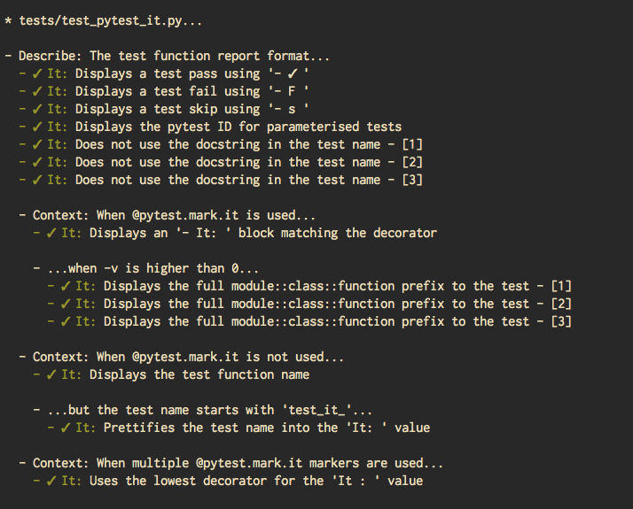

pytest-it
=========

|PyPI|  |Travis|

Decorate your pytest suite with `RSpec-inspired <rspec.info>`_ markers ``describe``, ``context`` and
``it``. Then run ``pytest --it`` to see a plaintext, org-mode compatible spec of the
test structure.

Install
-------

``pytest-it`` is `available on PyPi <https://pypi.org/project/pytest-it/>`_: ``pip install pytest-it``.

Examples
--------

A basic example that uses ``pytest.mark.describe``, ``pytest.mark.context`` and ``pytest.mark.it``:

.. code-block:: python

    from pytest import mark as m

    @m.describe("The test function report format")
    class TestPytestItExample(object):

        @m.context("When @pytest.mark.it is used")
        @m.it("Displays an '- It: ' block matching the decorator")
        def test_it_decorator(self, testdir):
            pass

This produces::

  - Describe: The test function report format...

    - Context: When @pytest.mark.it is used...
      - ✓ It: Displays an '- It: ' block matching the decorator

``Describe`` and ``Context`` blocks can be nested arbitrarily by using multiple
markers, eg:

.. code-block:: python

    from pytest import mark as m

    @m.describe("The test function report format")
    class TestPytestItExample(object):

        @m.context("When @pytest.mark.it is not used")
        @m.it("Displays the test function name")
        def test_no_argument(self, testdir):
            pass

        @m.context("When @pytest.mark.it is not used")
        @m.context("but the test name starts with 'test_it_'")
        @m.it("Prettifies the test name into the 'It: ' value")
        def test_populates_the_it_marker_using_function_name(self, testdir):
            pass

This produces::

  - Describe: The test function report format...

    - Context: When @pytest.mark.it is not used...
      - ✓ It: Displays the test function name

      - ...but the test name starts with 'test_it_'...
        - ✓ It: Prettifies the test name into the 'It: ' value

Behaviour
---------

- Pytest markers are used to specify the ``Describe:``, ``Context:`` and ``It:``
  sections. You can set these in all the usual ways that you specify pytest
  markers.

- ``Describe`` and ``Context`` can be nested arbitrarily.

- If ``--collect-only`` is used, it displays the same ``pytest-it`` spec as usual, but
  without the test result (✓/F/s).

- If ``-v`` is higher than 0, the full path to the test function is include in the
  test name.

- If ``pytest.mark.it`` is not used on a test, the test name is displayed instead
  of the ``It: does something`` output.

- If ``pytest.mark.it`` is not used but the test name starts with ``test_it``,
  ``pytest-it`` will prettify the test name into an ``It: does something`` value.

- The test output should be able to be copied directly into an `org-mode <https://orgmode.org/>`_ file.

Background
-----------

Pytest provides a lot of useful features for testing in Python, but when testing
complex systems, it can be hard to clearly communicate the intent of a test
using the standard ``test_module.py::TestClass::test_function`` structure.

One way to improve clarity is to use a BDD testing framework
(eg. `Behave <https://github.com/behave/behave>`_,
`Mamba <https://github.com/nestorsalceda/mamba>`_, `Rspec <http://rspec.info>`_), but
it's not always desirable to restructure existing test and program code.

There are some pytest plugins that attempt to bridge this gap, by providing
alternative ways to structure the tests (eg. `pytest-describe
<https://github.com/ropez/pytest-describe>`_, `pytest-bdd <https://github.com/pytest-dev/pytest-bdd>`_), or
altering the test report output (eg. `pytest-testdox <https://github.com/renanivo/pytest-testdox>`_, `pytest-pspec <https://github.com/gowtham-sai/pytest-pspec>`_).

``pytest-it`` takes a similar approach to ``pytest-testdox``, by providing pytest
markers that can describe the test output. ``pytest-it`` supports a few other
features, such as:

- A plaintext test structure that can easily be copied to markdown/org-mode documents.
- Arbitrary nesting of ``describe`` and ``context`` markers.
- Supporting the ``--collect-only`` pytest flag to display test structure.
- Displaying the full path to each test if ``-v`` is used.
- Neatly integrating tests in the output if they don't use the ``pytest-it``
  markers.

Although ``pytest-it`` does not change the behaviour of pytest tests, you may find it
a useful tool for thinking about test structure, and communicating the intention
of both the test code and the system under test.

.. |PyPI| image:: https://img.shields.io/pypi/v/pytest-it.svg
   :target: https://pypi.python.org/pypi/pytest-it

.. |Travis| image:: https://travis-ci.org/mattduck/pytest-it.svg?branch=master
   :target: https://travis-ci.org/mattduck/pytest-it
